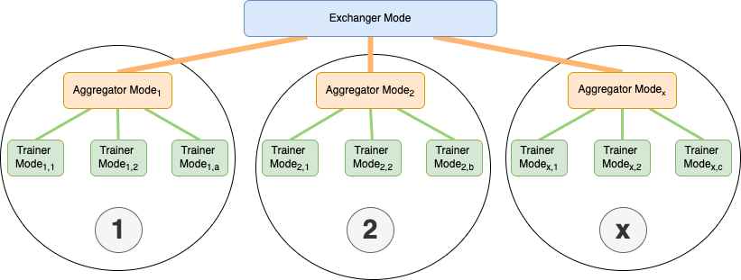
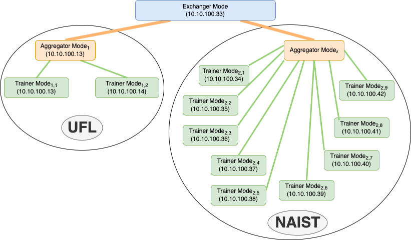
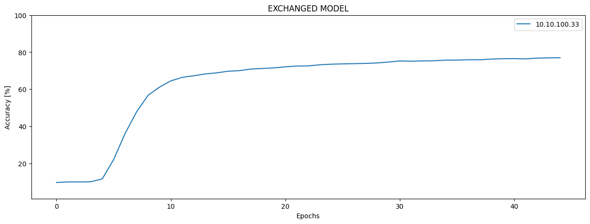
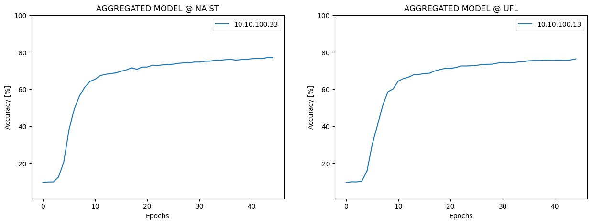
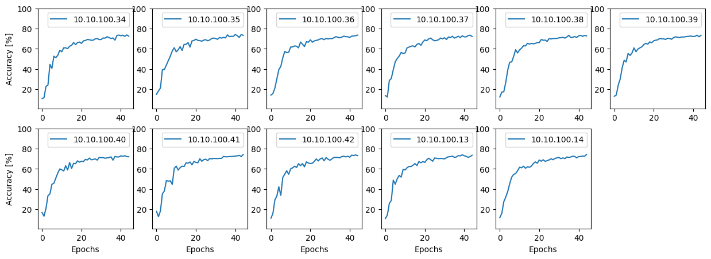
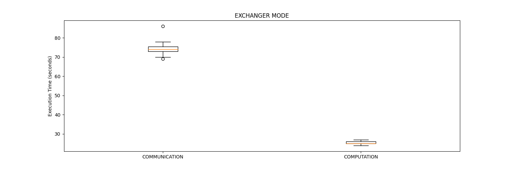
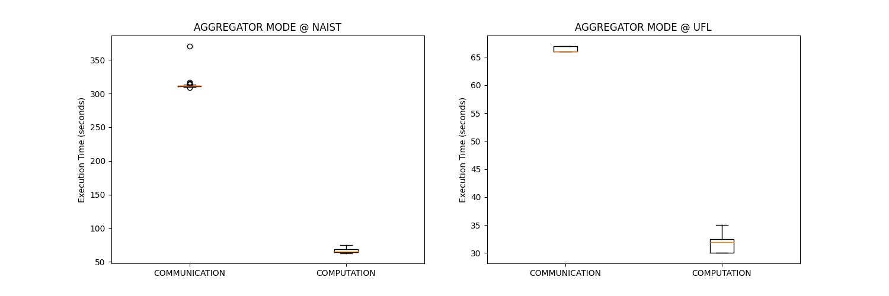
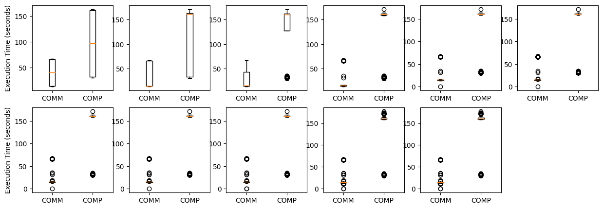
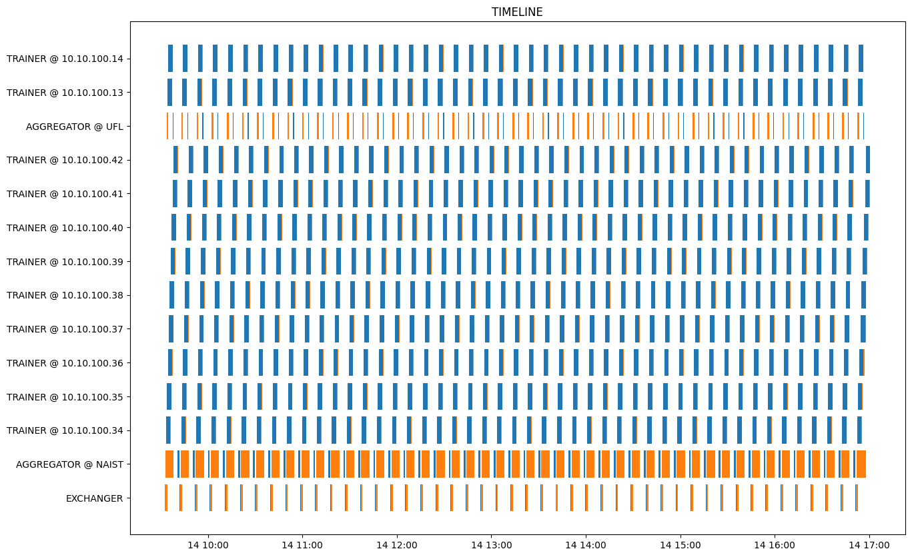
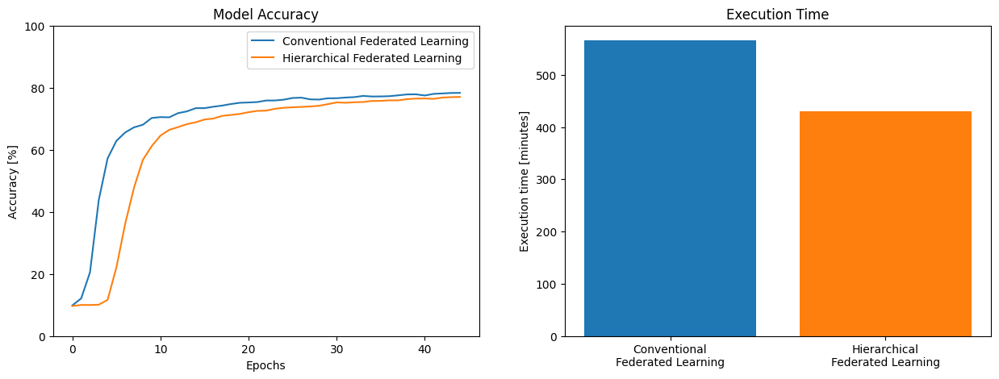

# Hierarchical Federarted Learning

## Docker Image
```
sudo docker run -it -p 19190:19190 -p 19191:19191 -p 19192:19192 kundjanasith/pik8ke_swarmlearning:hfl0.0.3
```

## Directory
```
.
|--exchanger_mode/
|   |--aggregated_models/
|   |--exchanged_models/
|   |--main.py
|   |--server.py 
|--aggregator_mode/
|   |--aggregated_models/
|   |--exchanged_models/
|   |--trained_models/
|   |--main.py
|   |--server.py 
|--trainer_mode/
|   |--exchanged_models/
|   |--trained_models/
|   |--main.py
|--utils.py
|--Dockerfile
|--config.ini
```

## Overview



## Set up




## Result

### Model accuracy




### Execution time




### Timeline


## Comparison


